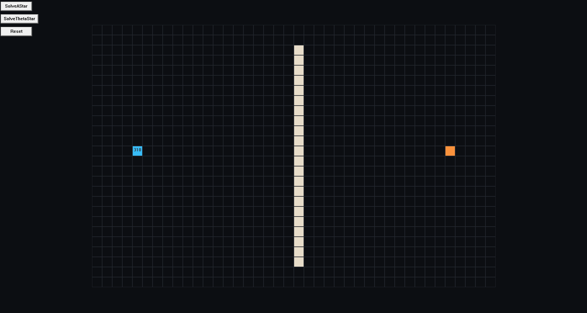

# GameplayProgramming Research Project: Theta*
Name: Aaron Van Sichem De Combe 2DAE19

Github link: https://github.com/Howest-DAE-GD/gameplay-programming-research-AaronVSDC.git

for my research project of the GPP course at DAE I decided to make a demonstration about the Theta* algorithm. In this demo we will look at an example of both the A* algorithm and how the Theta* algorithm differs from A*. 


## A* 



The A* algorithm is a very popular algorithm that finds the shortest path in a given grid (like dijkstra) but uses heuristic as an optimization.

```cpp
void AStar::Step()
{
    if (!m_CurrentNode) return;

    if (m_IsBacktracking)
    {
        BacktrackStep();
        return;
    }

    if (m_CurrentNode == m_DestinationNode)
    {
        m_IsBacktracking = true;
        m_BacktrackNode = m_CurrentNode;
        return;
    }

    EvaluateNeighbors();
    SelectLowestCostNode();
}
```
My implementation works like this:
if the current node is not the destination node, we evaluate the neighbors and then select the lowest cost node. 
```cpp

void AStar::EvaluateNeighbors()
{
    auto& nodes = m_Grid.GetNodes();
    const int rows = m_Grid.GetAmountOfGridRows();
    const int cols = m_Grid.GetAmountOfGridCols();

    auto inBounds = [&](int row, int column) { return row >= 0 && row < rows && column >= 0 && column < cols; };
    auto isPassable = [&](int row, int column) { if (!inBounds(row, column)) return false; return nodes[row][column]->nodeType != NodeType::Obstacle; };

    auto tryNeighbor = [&](int row, int column, bool diagonal)
        {
            if (!inBounds(row, column)) return; 

            if (diagonal)
            {
                if (!(isPassable(m_CurrentNode->row, column) or isPassable(row, m_CurrentNode->column))) 
                    return;
            }

            Node* neighbor = nodes[row][column]; 
            if (!isPassable(row, column)) 
                return;
            if (neighbor->closed) return;

            CalculateNodeCost(m_CurrentNode, neighbor);

            if (!neighbor->open)
            {
                neighbor->open = true;
                m_OpenList.push_back(neighbor);
            }
        };

    tryNeighbor(m_CurrentNode->row - 1, m_CurrentNode->column, false); // up
    tryNeighbor(m_CurrentNode->row + 1, m_CurrentNode->column, false); // down
    tryNeighbor(m_CurrentNode->row, m_CurrentNode->column + 1, false); // right
    tryNeighbor(m_CurrentNode->row, m_CurrentNode->column - 1, false); // left
	tryNeighbor(m_CurrentNode->row - 1, m_CurrentNode->column - 1, true); // upLeft
    tryNeighbor(m_CurrentNode->row - 1, m_CurrentNode->column + 1, true); // upRight
    tryNeighbor(m_CurrentNode->row + 1, m_CurrentNode->column + 1, true); // downRight
    tryNeighbor(m_CurrentNode->row + 1, m_CurrentNode->column - 1, true); // downLeft

    m_OpenList.remove(m_CurrentNode); 
    m_CurrentNode->closed = true;
    m_CurrentNode->open = false;
    m_ClosedList.push_back(m_CurrentNode);
}
void AStar::CalculateNodeCost(Node* currentNode, Node* neighborNode)
{
	const bool diagonal = currentNode->row != neighborNode->row and currentNode->column != neighborNode->column;
	const int stepCost = diagonal ? m_CostDiagonal : m_CostStraight;

    const int baseG = currentNode->gScore;
    const int tentativeG = baseG >= INT_MAX / 8 ? baseG : baseG + stepCost;

    if (!neighborNode->open or tentativeG < neighborNode->gScore)
    {
        neighborNode->parent = currentNode; 
        neighborNode->gScore = tentativeG;
        neighborNode->hScore = CostOctile(neighborNode, m_DestinationNode);
        neighborNode->fScore = neighborNode->gScore + neighborNode->hScore; 
    }
}
```
We check all 8 neighbors, calculate their node cost (Octile) and push them to the open list. When all neighbors are evaluated and pushed, the current node gets pushed to the closed list. 

```cpp
void AStar::SelectLowestCostNode()
{
    if (m_OpenList.empty()) { m_CurrentNode = nullptr; return; }

    auto it = std::ranges::min_element(
        m_OpenList.begin(), m_OpenList.end(),
        [](const Node* a, const Node* b) 
        {
            if (a->fScore != b->fScore) return a->fScore < b->fScore;
            if (a->hScore != b->hScore) return a->hScore < b->hScore;
            return a->gScore > b->gScore; 
        });

    m_CurrentNode = (it != m_OpenList.end()) ? *it : nullptr;
}
```
Then in the SelectLowestCostNode() we just iterate over the openlist, check which one has the lowest cost, and then assign it to the m_CurrentNode. 

```cpp
void AStar::BacktrackStep()
{
    if (!m_BacktrackNode) return;

    if (m_BacktrackNode->parent and m_BacktrackNode->parent != m_StartNode)
    {
        m_BacktrackNode->parent->nodeType = NodeType::Path;
    }

    m_BacktrackNode = m_BacktrackNode->parent;

    if (!m_BacktrackNode or m_BacktrackNode == m_StartNode)
    {
        m_IsBacktracking = false;
        m_CurrentNode = nullptr;
    }
}
```
The final backtrack step just backtracks all the nodes from destination to start and marks them as a path. 

What you might notice with this approach, is that while A* always finds the shortest path, it doesnt really look like a realistic one an npc would take. A way to adress this issue is by using the Theta* variant of the algorithm instead.  


## Theta* 


The Theta* variant is very much alike the A*. The one big difference is that it does an extra step -> the visibility check. 
```cpp
void ThetaStar::Step()
{
    if (!m_CurrentNode)
        return;

    if (m_IsBacktracking)
    {
        BacktrackStep();
        return;
    }

    if (m_CurrentNode == m_DestinationNode)
    {
        m_IsBacktracking = true;
        m_BacktrackNode = m_CurrentNode; 
        return;
    }

    EvaluateNeighbors();
    SelectLowestCostNode();
}
```
When we look at my code for the Theta* algorithm the high level methods are exactly the same. But there are a few key differences

```cpp
void ThetaStar::EvaluateNeighbors()
{
    auto& nodes = m_Grid.GetNodes();

    auto inBounds = [&](int row, int column) { return row >= 0 and row < m_Grid.GetAmountOfGridRows() and column >= 0 and column < m_Grid.GetAmountOfGridCols(); }; 
    auto isPassable = [&](int row, int column) { if (!inBounds(row, column)) return false; return nodes[row][column]->nodeType != NodeType::Obstacle; };

    auto tryNeighbor = [&](int row, int column, bool diagonal)
        {
            if (!inBounds(row, column)) return;

            if (diagonal)
            {
                if (!(isPassable(m_CurrentNode->row, column) or isPassable(row, m_CurrentNode->column)))
                    return;
            }

            Node* neighbor = nodes[row][column]; 
            if (!isPassable(row, column))
                return;
            if (neighbor->closed) return;

            CalculateNodeCost(m_CurrentNode, neighbor);

            if (!neighbor->open)
            {
                neighbor->open = true;
                m_OpenList.push_back(neighbor);
            }
        };

    tryNeighbor(m_CurrentNode->row - 1, m_CurrentNode->column, false); // up
    tryNeighbor(m_CurrentNode->row + 1, m_CurrentNode->column, false); // down
    tryNeighbor(m_CurrentNode->row, m_CurrentNode->column + 1, false); // right
    tryNeighbor(m_CurrentNode->row, m_CurrentNode->column - 1, false); // left
    tryNeighbor(m_CurrentNode->row - 1, m_CurrentNode->column - 1, true); // upLeft
    tryNeighbor(m_CurrentNode->row - 1, m_CurrentNode->column + 1, true); // upRight
    tryNeighbor(m_CurrentNode->row + 1, m_CurrentNode->column + 1, true); // downRight
    tryNeighbor(m_CurrentNode->row + 1, m_CurrentNode->column - 1, true); // downLeft

    m_OpenList.remove(m_CurrentNode);
    m_CurrentNode->closed = true;
    m_CurrentNode->open = false;
    m_ClosedList.push_back(m_CurrentNode); 
}
```
At first glance our EvaluateNeighbors() looks exactly the same aswell, but the CalculateNodeCost is calculating the node values differently. 

```cpp
void ThetaStar::CalculateNodeCost(Node* currentNode, Node* expandedNode)
{
    const int gViaCurrentNode = currentNode->gScore + CostEuclidian(currentNode, expandedNode);

    int bestG = gViaCurrentNode;
    Node* bestParent = currentNode;

    if (HasLineOfSight(currentNode->parent, expandedNode))
    {
        const int gViaParent = currentNode->parent->gScore + CostEuclidian(currentNode->parent, expandedNode);
        if (gViaParent < bestG)
        {
            bestG = gViaParent;  
            bestParent = currentNode->parent;
        }
    }
     
    if (!expandedNode->open or bestG < expandedNode->gScore)
    {
        expandedNode->parent = bestParent; 
        expandedNode->gScore = bestG; 
        expandedNode->hScore = CostEuclidian(expandedNode, m_DestinationNode);
        expandedNode->fScore = expandedNode->gScore + expandedNode->hScore;
    }

}
```
We already notice a few differences here, firstly we use euclidian cost to calculate our g, h, and f score. And secondly, we add a HasLineOfSight check. 
When we expand our node, we look at the parent of the node we just came from. We check if that parent can be reached (with the line of sight) if true -> that becomes our new parent. If false -> we use the regular parent from A*. 

```cpp
bool ThetaStar::HasLineOfSight(const Node* a, const Node* b) const
{
    double x0 = a->column + 0.5;
    double y0 = a->row + 0.5;
    double x1 = b->column + 0.5;
    double y1 = b->row + 0.5;

    int x = a->column;
    int y = a->row;

    const int tx = b->column;
    const int ty = b->row;

    const double dx = x1 - x0;
    const double dy = y1 - y0;

    const int stepX = (dx > 0) ? 1 : (dx < 0) ? -1 : 0;
    const int stepY = (dy > 0) ? 1 : (dy < 0) ? -1 : 0;

    const double tDeltaX = (stepX != 0) ? 1.0 / std::abs(dx) : std::numeric_limits<double>::infinity();
    const double tDeltaY = (stepY != 0) ? 1.0 / std::abs(dy) : std::numeric_limits<double>::infinity();

    const double nextV = (stepX > 0) ? (std::floor(x0) + 1.0) : (std::ceil(x0) - 1.0);
    const double nextH = (stepY > 0) ? (std::floor(y0) + 1.0) : (std::ceil(y0) - 1.0);

    double tMaxX = (stepX != 0) ? std::abs(nextV - x0) * tDeltaX : std::numeric_limits<double>::infinity();
    double tMaxY = (stepY != 0) ? std::abs(nextH - y0) * tDeltaY : std::numeric_limits<double>::infinity();

    if (!IsNodePassable(y, x) || !IsNodePassable(ty, tx))
        return false;

    while (x != tx || y != ty)
    {
        if (tMaxX < tMaxY) 
        {
            x += stepX;
            tMaxX += tDeltaX;
            if (!IsNodePassable(y, x)) return false;
        }
        else if (tMaxY < tMaxX) {
            y += stepY;
            tMaxY += tDeltaY;
            if (!IsNodePassable(y, x)) return false;
        }
        else {
            const int xn = x + stepX;
            const int yn = y + stepY;

            if (!IsNodePassable(y, xn) and !IsNodePassable(yn, x))
                return false;

            x = xn; y = yn;
            tMaxX += tDeltaX;
            tMaxY += tDeltaY;

            if (!IsNodePassable(y, x)) return false;
        }
    }
    return true;
}

```
The line of sight algorithm used is the "Bresenham's Midpoint Line Drawing Algorithm". 

The SelectLowestCostNode() remains unchanged for the Theta* algorithm. 

```cpp
void ThetaStar::BacktrackStep()
{
    if (!m_BacktrackNode) return;

    if (m_BacktrackNode == m_StartNode)
    {
        FinalizePathVisualization(); 
        m_IsBacktracking = false;
        m_CurrentNode = nullptr;
        return;
    }

    if (!m_BacktrackNode->parent)
    {
        m_IsBacktracking = false;
        m_CurrentNode = nullptr;
        return;
    }

    m_BacktrackNode = m_BacktrackNode->parent;
}
void ThetaStar::FinalizePathVisualization()
{
    auto chain = ReconstructPathChain();
    auto waypoint = ExtractWaypoints(chain);
    m_Waypoints = std::move(waypoint);  
}
```
The BacktrackStep() is a bit different in the sense that I finalize the path visualization with marking the nodes as a path in the ReconstructPathChain() and then set waypoints for the line in the ExtractWaypoints(). Then I finally draw a line with all the waypoints from the m_Waypoints vector.  


```cpp
std::vector<Node*> ThetaStar::ExtractWaypoints(const std::vector<Node*>& chain) const
{
    std::vector<Node*> waypoint;
    if (chain.empty()) return waypoint;

    Node* last = chain.front(); 
    waypoint.push_back(last); 

    Node* previous = last;
    for (size_t i = 1; i < chain.size(); ++i)
    {
        Node* current = chain[i];
        if (!HasLineOfSight(last, current)) 
        { 
            if (previous != waypoint.back()) waypoint.push_back(previous);
            last = previous;
        }
        previous = current;
    }
    if (waypoint.back() != chain.back()) waypoint.push_back(chain.back()); 
    return waypoint;
}

```
Because my demo uses a grid with the vertices in the middle of each node, i also do string pulling as a final step before i draw the line to make it look nice. (so I check the HasLineOfSight for a final time and iterate)


## Source Material Used: 
Introduction to A*
https://theory.stanford.edu/~amitp/GameProgramming/AStarComparison.html

Theta* path planning
https://www.youtube.com/watch?v=vj1IhhDRNR4

Theta*: Any-Angle Path Planning on Grids
https://cdn.aaai.org/AAAI/2007/AAAI07-187.pdf